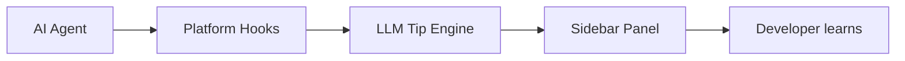

# Learn While Coding

Surface engineering concepts to learn during AI-assisted coding — so you grow as a developer while using Cursor, Claude Code, or VS Code.

## The problem

When developers use AI to write code (vibe coding, spec-driven development, agent mode), they ship features fast but often miss the underlying engineering: design decisions, new APIs, patterns, and tradeoffs they would have learned by reading docs and researching.

## The solution

**Learn While Coding** watches your AI coding sessions and, after each agent turn, generates 2–3 short **learning cards** in a sidebar panel:

- Concept name and one-sentence explanation
- Why it appeared in *this* session
- Links to official documentation
- Mark as learned / dismiss



## Install

### 1. VS Code extension (required for UI)

Install **Learn While Coding** from:
- [VS Code Marketplace](https://marketplace.visualstudio.com/items?itemName=learnwhile.learn-while-coding)
- Open VSX (for VSCodium)
- Works in **Cursor**, **VS Code**, and **Claude Code in VS Code**

### 2. Platform hooks (required for auto-tips)

```bash
git clone https://github.com/learnwhile/learn-while-coding
cd learn-while-coding
chmod +x scripts/install.sh
./scripts/install.sh
```

Or install components separately:

| Component | Install |
|-----------|---------|
| Hook runner | `npm i -g @learnwhile/hook-runner` |
| Cursor plugin | [Cursor Marketplace](https://cursor.com/marketplace) — search "learn-while-coding" |
| Claude Code | Merge `plugins/claude/settings.json` into `~/.claude/settings.json` |

### 3. Configure API key

Run command palette: **Learn While Coding: Setup API Key**

Or create `~/.learnwhile/config.json`:

```json
{
  "provider": "anthropic",
  "apiKey": "your-key",
  "model": "claude-haiku-4-5",
  "maxTipsPerTurn": 3,
  "enabled": true,
  "showNotifications": true
}
```

## How it works

1. **Hooks** capture each agent turn (prompt, response, file edits, tools)
2. On `stop` (Cursor) or `Stop` (Claude), the **hook runner** calls your LLM with session context
3. The LLM returns 0–3 learning concepts (deduped per session)
4. Tips are written to `~/.learnwhile/sessions/<id>/latest.json`
5. The **sidebar extension** watches that file and displays cards

## Platform support

| Platform | Auto-tips | Notes |
|----------|-----------|-------|
| Cursor | Yes | Install Cursor plugin + extension |
| Claude Code (CLI) | Yes | Hooks in `~/.claude/settings.json` |
| Claude Code (VS Code) | Yes | Same hooks as CLI |
| VS Code + Copilot | Partial | No chat API — extension UI only; hooks N/A |
| JetBrains + Claude | Yes | Shares Claude hooks |

## Privacy

- Tips are generated using **your** API key and **your** chosen LLM provider
- Session context (prompt, response, file paths) is sent to that provider
- Secrets are redacted before LLM calls
- No telemetry by default
- All data stays in `~/.learnwhile/` on your machine

## Development

```bash
pnpm install
pnpm build
./scripts/install.sh --cursor
```

Load extension in VS Code: open `extension/` folder, press F5.

## Monorepo structure

```
packages/core/          @learnwhile/core — LLM tip engine
packages/hook-runner/   @learnwhile/hook-runner — CLI for hooks
extension/              VS Code sidebar extension
plugins/cursor/         Cursor marketplace plugin
plugins/claude/         Claude Code hooks template
scripts/                install.sh, hook.sh
```

## Publish

See [PUBLISH.md](./PUBLISH.md) for marketplace submission steps.

## License

MIT
